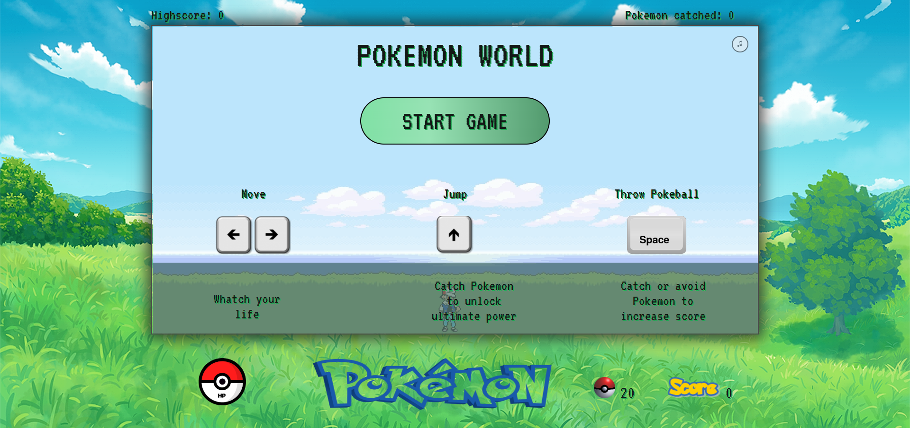
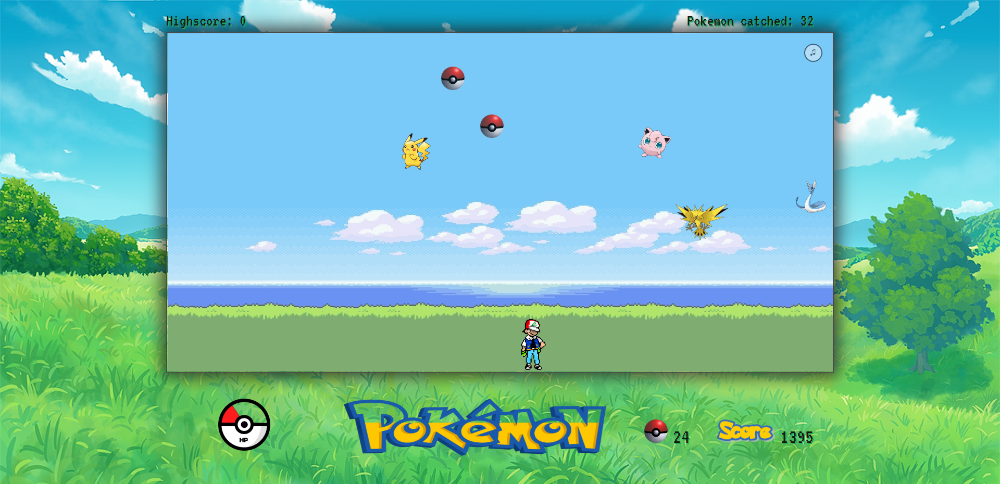

# Object Oriented Programming Game Project

This is a small HTML, CSS, and Javascript game. Using keyboard keys, you must catch and avoid multiple pokemon to increase your score. There are many features, such as:
<li> Sounds effects. </li>
<li> Start/Restart Button. </li>
<li> Player can jump. </li>
<li> A lives system. </li>
<li> A score & highscore system. </li>
<li>The power bar increases when you catch Pokemon and gives you super power when it is full.  </li>
<li> As the score increases, the difficulty increases.</li>
 
<b> To play the game : https://pokemonworldgame.netlify.app/ <b>
 
 

